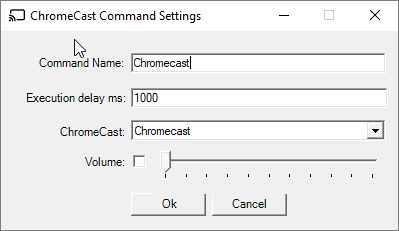
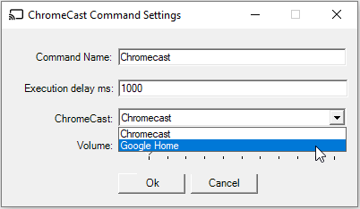

# ChromeCast Command for Remote Controller
This is a plugin for https://github.com/karpach/remote-controller.
The command gives an ability to cast YouTube videos, video files over HTTP and audio files over HTTP.

Command Name - a name of the command, gives you an ability to control different Google keep lists.

Execution delay - a delay before command starts its execution.

ChromeCast - chrome cast name in current network.

Volume - optional volume override

You also need to supply the following command parameters:

1. VideoId - YouTube video id (e.g for https://www.youtube.com/watch?v=2MpUj-Aua48, videoId = 2MpUj-Aua48)
2. URL for video or audio as well as Content Type (e.g audio/mp3, video/mp4)

